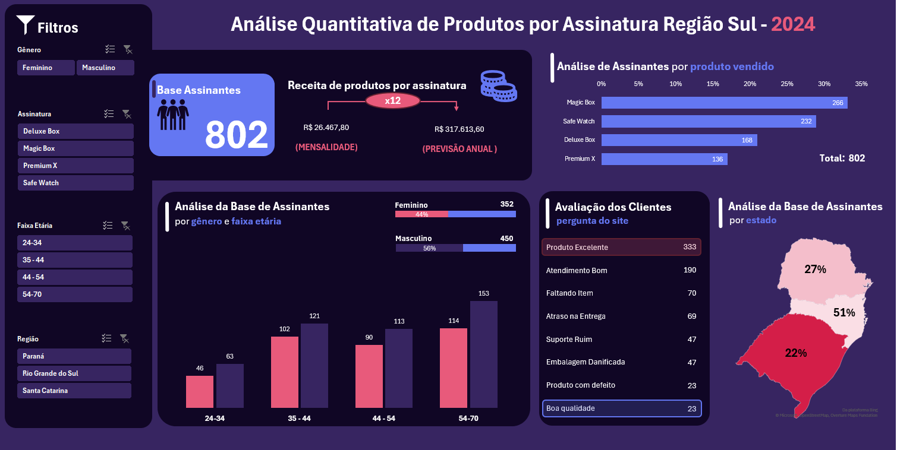

<h1 align="center">
   
  <strong> Análise Quantitativa de Produtos por Assinatura - Região Sul (2024) </strong>
</h1>

Este relatório detalha a análise de um dashboard de vendas focado em produtos por assinatura na Região Sul, com dados de 2024. O objetivo principal é demonstrar a aplicação de técnicas de tratamento de dados, criação de tabelas dinâmicas e visualização de informações para extrair insights estratégicos e identificar oportunidades de melhoria.

## Habilidades Demonstradas no Projeto

Este projeto reflete meu conhecimento e prática em:

*   **Tratamento de Dados**: Incluindo formatação de campos específicos (ex: CPF) e cálculos complexos (ex: idade a partir da data de nascimento) para enriquecer a base de dados.
*   **Criação de Tabelas Dinâmicas**: Essenciais para sumarizar grandes volumes de dados e permitir análises multidimensionais, como a relação entre produtos e assinaturas.
*   **Desenvolvimento de Gráficos e Dashboards**: Utilizando ferramentas para criar visualizações claras e impactantes que facilitam a identificação de padrões e oportunidades.

## Visão Geral do Dashboard

  

O dashboard apresenta as seguintes seções principais:

*   **Base de Assinantes**: Número total de assinantes.
*   **Receita de Produtos por Assinatura**: Receita mensal e previsão anual.
*   **Análise de Assinantes por Produto Vendido**: Distribuição de assinantes por tipo de produto.
*   **Análise da Base de Assinantes por Gênero e Faixa Etária**: Demografia dos assinantes.
*   **Avaliação dos Clientes**: Feedback qualitativo dos assinantes.
*   **Análise da Base de Assinantes por Estado**: Distribuição geográfica dos assinantes na Região Sul.

## Análise Detalhada e Implicações Estratégicas

### Base de Assinantes e Receita

O dashboard indica uma **Base de Assinantes de 802 clientes**. Este número é a fundação para todas as análises subsequentes e representa o tamanho atual do mercado atendido. A **Receita Mensal de R$ 26.467,80** e a **Previsão Anual de R$ 317.613,60** são métricas cruciais que demonstram a saúde financeira do negócio de assinaturas. A projeção anual é particularmente importante para o planejamento financeiro e a definição de metas de crescimento.

**Decisões Estratégicas e Melhorias:**

*   **Foco na Retenção**: Com uma base de assinantes estabelecida, a retenção de clientes deve ser uma prioridade. Programas de fidelidade, comunicação personalizada e excelência no atendimento ao cliente são essenciais para garantir a continuidade da receita.
*   **Estratégias de Aquisição**: Para expandir a receita, é vital desenvolver estratégias de aquisição de novos assinantes. Isso pode incluir campanhas de marketing digital direcionadas, parcerias estratégicas ou ofertas de introdução.
*   **Análise de Churn**: Monitorar a taxa de *churn* (cancelamento de assinaturas) é fundamental. Entender os motivos pelos quais os clientes cancelam pode levar a melhorias no produto ou serviço e, consequentemente, à redução do *churn*.
*   **Otimização de Preços**: A análise da receita pode levar a discussões sobre a otimização de preços. Testar diferentes modelos de precificação ou pacotes de assinatura pode maximizar o valor percebido e a receita total.

### Análise de Assinantes por Produto Vendido

Esta seção detalha a distribuição dos 802 assinantes entre os diferentes produtos oferecidos. O produto **Magic Box** lidera com 266 assinantes, seguido por **Safe Watch** com 232, **Deluxe Box** com 168 e **Premium X** com 136. Esta distribuição é crucial para entender a popularidade de cada oferta e direcionar esforços de marketing e desenvolvimento de produtos.

**Decisões Estratégicas e Melhorias:**

*   **Capitalizar Produtos Líderes**: O Magic Box e o Safe Watch são os produtos mais populares. A empresa deve continuar investindo neles, talvez explorando variações, complementos ou campanhas de marketing que reforcem sua liderança de mercado. Entender o que torna esses produtos atraentes pode ajudar a replicar o sucesso em outras ofertas.
*   **Impulsionar Produtos com Menor Desempenho**: Premium X e Deluxe Box, embora com menor número de assinantes, representam uma oportunidade de crescimento. A empresa pode investigar os motivos do menor desempenho: preço, funcionalidades, marketing inadequado ou falta de conscientização. Estratégias podem incluir reformulação do produto, campanhas promocionais agressivas ou reposicionamento no mercado.
*   **Análise de Mercado e Concorrência**: Comparar o desempenho desses produtos com o de concorrentes pode revelar lacunas ou oportunidades. Há espaço para inovar ou diferenciar os produtos menos populares para torná-los mais competitivos?
*   **Cross-selling e Upselling**: Com base na preferência dos assinantes, é possível criar estratégias de *cross-selling* (venda cruzada de produtos complementares) e *upselling* (oferecer versões mais premium) para aumentar o valor médio por assinante. Por exemplo, oferecer o Premium X como um upgrade para assinantes do Deluxe Box.
*   **Feedback Específico por Produto**: Coletar feedback específico para cada produto pode fornecer insights valiosos para melhorias. Os assinantes do Premium X, por exemplo, podem ter sugestões que, se implementadas, poderiam aumentar sua popularidade.

### Análise da Base de Assinantes por Gênero e Faixa Etária

Esta seção do dashboard fornece uma visão demográfica crucial da base de assinantes. Observa-se que a base é composta por **56% de assinantes masculinos (450)** e **44% de assinantes femininos (352)**. A análise por faixa etária revela a distribuição dos assinantes em diferentes grupos:

*   **24-34 anos**: Representa um grupo significativo, com 46 assinantes femininos e 63 masculinos.
*   **35-44 anos**: É a maior faixa etária, com 102 assinantes femininos e 121 masculinos.
*   **44-54 anos**: Apresenta 90 assinantes femininos e 113 masculinos.
*   **54-70 anos**: Com 114 assinantes femininos e 153 masculinos, este grupo também é relevante.

**Decisões Estratégicas e Melhorias:**

*   **Marketing Segmentado**: A divisão por gênero e faixa etária permite a criação de campanhas de marketing altamente segmentadas. Por exemplo, mensagens e canais de comunicação podem ser adaptados para ressoar melhor com o público masculino ou feminino, ou com diferentes gerações.
*   **Desenvolvimento de Produtos Direcionados**: Compreender a demografia dos assinantes pode influenciar o desenvolvimento de novos produtos ou a adaptação dos existentes. Se uma faixa etária específica demonstra maior engajamento com um determinado produto, pode-se explorar variações ou complementos que atendam às suas necessidades e preferências.
*   **Otimização da Experiência do Usuário**: A experiência do usuário (UX) pode ser aprimorada ao considerar as características de cada grupo demográfico. Por exemplo, interfaces mais intuitivas para faixas etárias mais velhas ou conteúdo mais dinâmico para as mais jovens.
*   **Identificação de Nichos de Mercado**: A análise detalhada pode revelar nichos de mercado inexplorados. Se um determinado grupo demográfico está sub-representado, pode haver uma oportunidade para desenvolver estratégias específicas para atraí-lo.
*   **Análise de Preferências por Gênero/Idade**: Cruzar os dados demográficos com as preferências de produtos e o feedback dos clientes pode gerar insights poderosos. Por exemplo, se o Produto C é mais popular entre homens de 35-44 anos, isso pode guiar futuras campanhas de marketing ou o desenvolvimento de recursos.

### Avaliação dos Clientes

A seção de Avaliação dos Clientes oferece um feedback qualitativo valioso sobre a percepção dos assinantes em relação aos produtos e serviços. Os principais pontos de feedback são:

*   **Produto Excelente**: 333 avaliações
*   **Atendimento Bom**: 190 avaliações
*   **Faltando Item**: 70 avaliações
*   **Atraso na Entrega**: 69 avaliações
*   **Suporte Ruim**: 47 avaliações
*   **Embalagem Danificada**: 47 avaliações
*   **Produto com Defeito**: 23 avaliações
*   **Boa Qualidade**: 23 avaliações

**Decisões Estratégicas e Melhorias:**

*   **Capitalizar Pontos Fortes**: O alto número de avaliações de "Produto Excelente" e "Atendimento Bom" indica que a empresa está no caminho certo em relação à qualidade do produto e ao serviço ao cliente. Essas qualidades devem ser destacadas em campanhas de marketing e na comunicação com os clientes.
*   **Priorizar Resolução de Problemas Recorrentes**: As categorias "Faltando Item", "Atraso na Entrega", "Suporte Ruim", "Embalagem Danificada" e "Produto com Defeito" são áreas críticas que exigem atenção imediata. Cada uma dessas categorias representa uma falha na experiência do cliente e pode levar ao *churn*.
    *   **Logística**: "Faltando Item" e "Atraso na Entrega" apontam para problemas na cadeia de suprimentos e logística. Investir em sistemas de rastreamento mais eficientes, otimizar rotas de entrega e melhorar a comunicação com os parceiros logísticos pode mitigar esses problemas.
    *   **Atendimento ao Cliente**: "Suporte Ruim" é um alerta vermelho. É fundamental treinar a equipe de suporte, otimizar os canais de atendimento e garantir que as resoluções sejam rápidas e eficazes. A satisfação do cliente com o suporte é um diferencial competitivo.
    *   **Qualidade e Embalagem**: "Embalagem Danificada" e "Produto com Defeito" indicam problemas no controle de qualidade ou no processo de embalagem. Revisar os padrões de qualidade, fortalecer as inspeções e investir em embalagens mais robustas pode reduzir essas ocorrências.
*   **Ciclo de Feedback Contínuo**: Implementar um sistema robusto para coletar, analisar e agir sobre o feedback dos clientes de forma contínua. Isso pode incluir pesquisas de satisfação regulares, canais de comunicação abertos e um processo claro para escalar e resolver problemas.
*   **Transformar Críticas em Oportunidades**: Cada feedback negativo é uma oportunidade de melhoria. Ao resolver proativamente os problemas levantados pelos clientes, a empresa pode não apenas reter esses clientes, mas também transformá-los em defensores da marca.

### Análise da Base de Assinantes por Estado

A análise da base de assinantes por estado na Região Sul revela a seguinte distribuição:

*   **Paraná**: 51% dos assinantes
*   **Santa Catarina**: 27% dos assinantes
*   **Rio Grande do Sul**: 22% dos assinantes

Esta distribuição geográfica é fundamental para o planejamento de estratégias de marketing regionalizadas e para a otimização da logística.

**Decisões Estratégicas e Melhorias:**

*   **Foco no Paraná**: Dado que o Paraná concentra a maior parte dos assinantes, é estratégico manter e intensificar os esforços de marketing e vendas nesta região. Campanhas específicas para o estado, parcerias locais e eventos podem solidificar ainda mais a presença da empresa.
*   **Oportunidades em Santa Catarina e Rio Grande do Sul**: Embora com menor representatividade, Santa Catarina e Rio Grande do Sul apresentam um potencial significativo de crescimento. A empresa pode desenvolver estratégias de expansão direcionadas para essas regiões, como:
    *   **Campanhas de Conscientização**: Aumentar a visibilidade da marca e dos produtos através de publicidade local, mídias sociais segmentadas e parcerias com influenciadores regionais.
    *   **Ofertas Localizadas**: Criar promoções ou pacotes de produtos que sejam mais atraentes para os consumidores dessas regiões, considerando suas particularidades culturais e econômicas.
    *   **Melhoria da Logística**: Avaliar e otimizar a logística de entrega para Santa Catarina e Rio Grande do Sul, garantindo que a experiência do cliente seja tão eficiente quanto no Paraná. Reduzir prazos de entrega e custos de frete pode ser um diferencial competitivo.
*   **Análise de Diferenças Regionais**: Investigar se existem diferenças nas preferências de produtos ou no feedback dos clientes entre os estados. Essa análise pode levar a adaptações nos produtos ou na abordagem de vendas para melhor atender às necessidades de cada região.
*   **Expansão para Outras Regiões**: Com base no sucesso na Região Sul, a empresa pode considerar a expansão para outras regiões do Brasil, utilizando as lições aprendidas e as estratégias bem-sucedidas como base para o crescimento.

## Conclusão e Recomendações Finais

Este dashboard oferece uma visão abrangente do desempenho dos produtos por assinatura na Região Sul, destacando a importância da análise de dados para a tomada de decisões estratégicas. As principais conclusões e recomendações incluem:

1.  **Otimização da Base de Assinantes e Receita**: Focar na retenção de clientes e na aquisição de novos assinantes para garantir o crescimento contínuo da receita. Monitorar o *churn* e otimizar a precificação.
2.  **Estratégia de Produtos**: Capitalizar a popularidade de produtos como Magic Box e Safe Watch, enquanto se investe em estratégias para impulsionar o desempenho de Deluxe Box e Premium X. Explorar *cross-selling* e *upselling*.
3.  **Marketing e Desenvolvimento Demográfico**: Utilizar a análise por gênero e faixa etária para criar campanhas de marketing segmentadas e influenciar o desenvolvimento de produtos e a otimização da experiência do usuário.
4.  **Melhoria da Experiência do Cliente**: Priorizar a resolução de problemas recorrentes identificados no feedback dos clientes, como "Faltando Item", "Atraso na Entrega" e "Suporte Ruim". Capitalizar os pontos fortes como "Produto Excelente" e "Atendimento Bom".
5.  **Estratégias Regionalizadas**: Manter o foco no Paraná e explorar ativamente as oportunidades de crescimento em Santa Catarina e Rio Grande do Sul através de campanhas e logística otimizadas.

Ao aplicar essas análises e recomendações, a empresa estará mais bem equipada para otimizar suas operações, fortalecer o relacionamento com os clientes e impulsionar o crescimento sustentável no mercado de assinaturas.

🧠 Feito com café ☕ por Naty
